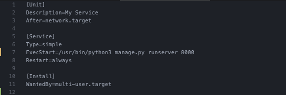

### 1. Запустите сервер

`python -m http.server 8000`

### 2. Создайте демона

#### Кто такой демон ?
Демон - это программа, которая работает на фоне, и которая продолжит работать даже после отключения терминала.
Мы хотим, чтобы наша команда запуска сервера стала демоном и работала на сервере независимо от терминала.

#### Кто такой SystemD ?

SystemD нам поможет контролировать этого демона, он будет запускать/останавливать/перезапускать демона (например, если будет ошибка или сервер перезапустится).
Для того, чтобы это сделать нам надо написать файл-инструкцию для SystemD, который должен называться `название_файла.service` и должен храниться в `/etc/systemd/system` . 




Этот файл может состоять из нескольких разделов. Названия разделов заключены в квадратные скобки.

### Зачем нужен раздел [SERVICE] ?
Это обязательный раздел, в котором хранится основная конфигурация демона.
И минимальная инструкция, которая должна быть в этом разделе это `ExecStart=`.

В `ExecStart=` нужно передать полный путь и аргументы команды, которую нужно запустить при старте демона.

>Собственно название говорит за себя: Execute (at) Start - Выполнить при старте/в начале

Давайте напишем наш первый файл и назовем его `http_sever_test.sevice`:
```
[Service]
ExecStart=python -m http.server 8000
```

Теперь нам нужно его запустить, тут на помощь приходит `systemctl` это инструмент, который помогает работать с нашими файлами-инструкциями.
Помогает запускать/останавливать/перезапускать , проверять состояние наших файлов и многое другое.

Итак, запустить наш файл мы можем с помощью команды `systemctl start название_файла`.

В нашем случае мы набираем `systemctl start http_sever_test.sevice`, нажимаем Enter и консоль нам отвечает:

```# systemctl start http_sever_test
Failed to start http_sever_test.service: Unit http_sever_test.service has a bad unit file setting.
See system logs and 'systemctl status http_sever_test.service' for details.
```

>Вольный перевод: Неудалось запустить ваш файл http_sever_test.service: в нём плохие инструкции.
>Наберите `systemctl status http_sever_test.service` , чтобы узнать что случилось.

Отлично! Тут мы узнаём, что у `systemctl` есть еще одна команда `systemctl status название_файла.service`.
Это команда позволяет узнать о состоянии нашего файла, запущен ли он, остановлен или может что-то с ним случилось.

Давайте наберём `systemctl status http_sever_test.service`. Получаем такой ответ:


Давайте разберем, что в нём написано:
- 3-я строка сверху: `Active: inactive (dead)` - говорит нам о том, что наш файл-инструкция неактивен (мёртв)
- 3-я строка снизу (выделено красным): `/etc/systemd/system/http_sever_test.service:2: Executable "python" not found in path "/usr/local/sbin:/usr/local/bin:/usr/sbin:/usr/bin:/sbin:/bin"` - говорит о том, что конкретно случилось? какая ошибка произошла?
В данном случае она говорит, что SystemD в соответсвии нашей инструкции (`ExecStart=python -m http.server 8000`) искал `python` и не смог его найти.
Действительно, если посмотреть, то конкретно на нашем сервере нет такой директории по такому адресу, но есть `python3` и `python3.8`.

Окей, давайте исправим наш файл-инструкцию:
```
[Service]
ExecStart=python3 -m http.server 8000
```

Запустим её с помощью уже знакомой нам команды `systemctl start http_sever_test.sevice`.
Проверим её состояние с помощью команды, с которой мы только что познакомились `systemctl status http_sever_test.service` и получаем такой ответ:


Разберем, что написано в этот раз:
- 2-я строка сверху `●http_sever_test.service`. Мы видим, что кружок возле названия нашего файла стал зелёным, а в прошлый раз был черный.
- 4-я строка сверху `Active: active (running)`. Слова `active (running)` означают "активный (запущен)". Кстати, как и кружок они стали зелеными, а в прошлый раз они были красными. 

Теперь давайте проверим сайт, пройдем в браузере по адресу `ip-сервера:8000` и что мы видим? Мы запустили сайт!


#### Подсказки: 
- как создать файл? ( `vim /etc/systemd/system/http_sever_test.service` )
