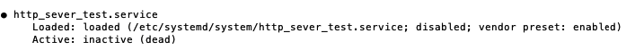
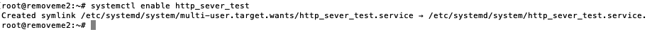

### 1. Запустите сервер

Зачем: Есть HTML страничка и установленный Python. Хочу поднять сайт на заранее арендованном сервере с последней версией Ubuntu LTS.

Цель: Захожу из браузера на IP адрес сервера и вижу сайт.

`python -m http.server 8000`

### 2. Создайте демона

Зачем: Если отключиться от сервера по ssh, то выключается и сайт

Цель: Отключаемся от сервера, но сайт всё ещё работает

#### Кто такой демон ?
Демон - это программа, которая работает на фоне, и которая продолжит работать даже после отключения терминала.
Мы хотим, чтобы наша команда запуска сервера стала демоном и работала на сервере независимо от терминала.

#### Кто такой SystemD ?

SystemD нам поможет контролировать этого демона, он будет запускать/останавливать/перезапускать демона (например, если будет ошибка или сервер перезапустится).
Для того, чтобы это сделать нам надо написать файл-инструкцию для SystemD, который должен называться `название_файла.service` и должен храниться в `/etc/systemd/system` . 


Этот файл может состоять из нескольких разделов. Названия разделов заключены в квадратные скобки. Например: `[UNIT]`, `[SERVICE]`, `[INSTALL]`.
Сейчас для нашей задачи понадобится раздел `[SERVICE]`.

#### Зачем нужен раздел [SERVICE] ?
Это обязательный раздел, в котором хранится основная конфигурация демона.
И минимальная инструкция, которая должна быть в этом разделе это `ExecStart=`.

В `ExecStart=` нужно передать полный путь и аргументы команды, которую нужно запустить при старте демона.

>Собственно название говорит за себя: Execute (at) Start - Выполнить при старте/в начале

Давайте напишем наш первый файл и назовем его `http_sever_test.sevice`:
```
[Service]
ExecStart=python -m http.server 8000
```

Теперь нам нужно его запустить, тут на помощь приходит `systemctl` это инструмент, который помогает работать с нашими файлами-инструкциями.
Помогает запускать/останавливать/перезапускать , проверять состояние наших файлов и многое другое.

Итак, запустить наш файл мы можем с помощью команды `systemctl start название_файла`.

В нашем случае мы набираем `systemctl start http_sever_test.sevice`, нажимаем Enter и консоль нам отвечает:

```bash
# systemctl start http_sever_test
Failed to start http_sever_test.service: Unit http_sever_test.service has a bad unit file setting.
See system logs and 'systemctl status http_sever_test.service' for details.
```

>Вольный перевод: Неудалось запустить ваш файл http_sever_test.service: в нём плохие инструкции.
>Наберите `systemctl status http_sever_test.service` , чтобы узнать что случилось.

Отлично! Тут мы узнаём, что у `systemctl` есть еще одна команда `systemctl status название_файла.service`.
Это команда позволяет узнать о состоянии нашего файла, запущен ли он, остановлен или может что-то с ним случилось.

Давайте наберём `systemctl status http_sever_test.service`. Получаем такой ответ:


Давайте разберем, что в нём написано:
- 3-я строка сверху: `Active: inactive (dead)` - говорит нам о том, что наш файл-инструкция неактивен (мёртв)
- 3-я строка снизу (выделено красным): `/etc/systemd/system/http_sever_test.service:2: Executable "python" not found in path "/usr/local/sbin:/usr/local/bin:/usr/sbin:/usr/bin:/sbin:/bin"` - говорит о том, что конкретно случилось? какая ошибка произошла?
В данном случае она говорит, что SystemD в соответсвии нашей инструкции (`ExecStart=python -m http.server 8000`) искал `python` и не смог его найти.
Действительно, если посмотреть, то конкретно на нашем сервере нет такой директории по такому адресу, но есть `python3` и `python3.8`.

Окей, давайте исправим наш файл-инструкцию:
```
[Service]
ExecStart=python3 -m http.server 8000
```

Запустим её с помощью уже знакомой нам команды `systemctl start http_sever_test.sevice`.
Проверим её состояние с помощью команды, с которой мы только что познакомились `systemctl status http_sever_test.service` и получаем такой ответ:


Разберем, что написано в этот раз:
- 2-я строка сверху `●http_sever_test.service`. Мы видим, что кружок возле названия нашего файла стал зелёным, а в прошлый раз был черный.
- 4-я строка сверху `Active: active (running)`. Слова `active (running)` означают "активный (запущен)". Кстати, как и кружок они стали зелеными, а в прошлый раз они были красными.

Мы поняли, что зелёный цвет - это хороший знак.

Теперь давайте проверим сайт, пройдем в браузере по адресу `ip-сервера:8000` и что мы видим? Мы запустили сайт!


А он точно работает продолжит работать даже после отключения терминала? Давайте убедимся, выйдите из терминала или наберите команду `exit`.
```bash
# exit
logout
Connection to 84.38.180.108 closed.
```
Сайт продолжает работать. Супер!


Подсказки: 
как создать файл? ( `vim /etc/systemd/system/http_sever_test.service` )

### 3. Добавьте в автозапуск
Зачем: Сервер иногда приходится перезапускать из-за обновления ПО и изменения настроек. Ещё хостинг провайдер периодически обновляет софт, чтобы закрыть свежие уязвимости, и самостоятельно перезапускает сервер.

Цель: Перезапускаем сервер, сайт запускается самостоятельно

Что будет если сервер перезагрузится?

Попробуем его перезагрузить, набираем `reboot now`, и видим, что сайт не работает.


#### Кто такой target?

Мы хотим, чтобы наш файл запускался во время запуска системы, чтобы это сделать в начале надо понять как запускается система.

Если совсем просто, то существует несколько уровней (очередей) запуска системы:
- сначала идет запуск "железа"
- потом загрузка самой ОС Linux
- и только потом идёт SystemD, а он дальше запускает все нужные программы.

Но сам SystemD тоже делит программы на уровни запуска программ (всего у него их 8).

Каждый уровень представлен как своего рода "группа запуска", которая содержит в себе ссылки на файлы-инструкции (как наши).
Эти группы называются target'ами и хранятся в файлах с названиями `название_файла_группы.target`.
Если коротко, то предназначение target'ов - это группировать другие файлы-инструкции и запускать или останавливать их оптом.

Файлы этих групп также как и файлы-инструкций состоят из таких же разделов (за исключением раздела `[SERVICE]`). Вы также можете писать свои собственные target'ы. Вот пример файла target'a:
```bash
[Unit]
Description=mysite
Requires=nginx.service mysql.service hhvm.service backup.timer
After=nginx.service mysql.service hhvm.service backup.timer
```
В этом примере используется рздел `[UNIT]`, который мы не разбирали (сейчас нам это не нужно знать), но мы сейчас разберем, что написано внутри этого раздела.
Обратите внимание на строчку `Requires=`, с английского переводится как `Требует`, это значит, что эта группа требует запуска всех файлов-инструкций, которые в ней перечислены.

Конкретно в этом примере требуется запуск следующих файлов-инструкций `nginx.service`, `mysql.service`, `hhvm.service` и `backup.timer`. То есть, этот target оптом запустит эти файлы-инструкции.

#### Кто такой multi-user.target?

Итак, я упоминал, что у SystemD есть уровни и каждый уровень представлен как своего рода "группа запуска" и эти группы называются target'ами.
Вот эти target'ы: `deafault.target`, `graphical.target`, `multi-user.target`, `resque.target`, `emergency-target`, `halt.target`, `reboot.target`, `poweroff.target`.

Нас интересует `multi-user.target`, по-русски он называется "многопользовательский режим", это когда запущены все программы запущены, но без графического интерфейса, то есть можно контролировать их работу только через терминал.
> Логично можно догадаться, что когда есть графический интерфейс - это когда запущен target `graphical.target`.

В общем, нам нужно сделать так, чтобы наш файл-инструкцию `http_sever_test.service` включили в группу `multi-user.target`.
То есть, чтобы в файле target'a `multi-user.target` появилась ссылка на наш `http_sever_test.service`, и тогда когда будут запускаться файлы-инструкции из `multi-user.target` запустится и наш.

#### Кто такой раздел `[INSTALL]` ?

Чтобы это сделать нам нужно немного изменить наш файл.
Нужно добавить в него еще один раздел `[INSTALL]`.
В этом разделе мы описываем настройки зависимости от других файлов-инструкций и других настроек системы.

Например,
- `RequiredBy=` Какие для каких файлов-инструкций **требуется** запуск нашего файла-инструкции? То есть без нашего файла другой файл не запустится совсем.
- `WantedBy=` Для каких запуск нашего файла **желателен**? Эта инструкция похожа на предыдущую, но не такая строгая. То есть другой файл запустится даже если наш не запустится.
- `Alias=` Эта инструкция описывает какой будет псевдоним для нашего файла.

Для нашей задачи подойдет инструкция `WantedBy=`. Мы должны дать такую инструкцию: `WantedBy=multi-user.target`
> В переводе на человеческий это значит: *"Запустите наш файл-инструкцию, когда будете запускать другие файлы из группы `multi-user.target` "*

Итак, наш файл `http_sever_test.service` приобретает такой вид:
```
[Service]
ExecStart=/usr/bin/python3 -m http.server 8000

[Install]
WantedBy=multi-user.target
```

Изменяем, запускаем `systemctl start http_sever_test` и смотрим состояние `systemctl status http_sever_test`.


Вроде всё отлично, пишет что `active (running)` и сайт работает.

Перезапускаем сервер и видим, что сайт не работает. В чем проблема?

Наберем `systemctl status http_sever_test` и видим следующее:



Да, действительно, наш файл-инструкция не запущен `inactive (dead)` (неактивен (мертв)).

Почему? Посмотрим на строчку, которую в прошлый раз мы не разобрали - `Loaded`.

`Loaded: loaded (/etc/systemd/system/http_sever_test.service; disabled; vendor preset: enabled)`

Здесь написано, что наш файл загружен (`loaded`) и дальше есть слово `disabled` - в этом слове и кроется ответ.

У нашего файл может быть несколько состояний:
- `enabled` - файл-инструкция включен в автозагрузку
- `disabled` - файл-инструкция не включен в автозагрузку
- `masked` - файл-инструкция скрыт, вы его не можете запустить
- `static` - файл-инструкция в автозагрузке, и вы не можете его отключить

Логично, что нам нужен первый вариант `enabled`.

Чтобы наш файл сделать `enabled` нам нужно запустить команду `systemctl enable http_sever_test`.

Давайте сделаем это, и получаем следующий ответ:


>Строка `Created symlink /etc/systemd/system/multi-user.target.wants/http_sever_test.service → /etc/systemd/system/http_sever_test.service.`
означает, что строка `http_sever_test.service` в target'e `multi-user.target` ссылается на наш файл-инструкцию `http_sever_test.service`, который находится в `/etc/systemd/system/`.

Ну теперь-то наверное получилось? Перезагрузим сервер и проверим.

Да, действительно всё сработало.


