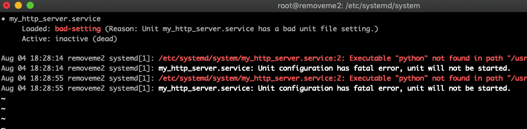
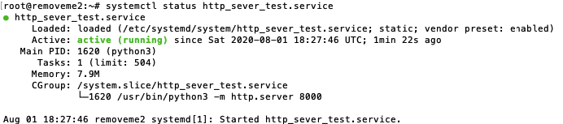
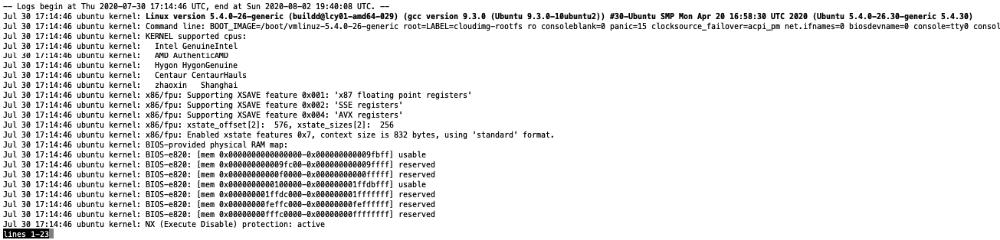
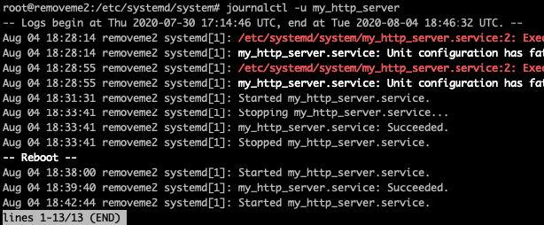

### 0. Загрузите сайт на сервер

Подкючитесь к вашему серверу по ssh.

Пройдите в главную папку сервера с помощью команды

`cd /`

Создайте папку `public_html` с помощью команды

`mkdir public_html`

Зайдите в неё

`cd public_html`

Загрузите [код сайта](https://raw.githubusercontent.com/su1tanb3k/systemd_tutorial/master/index.html)

`wget https://raw.githubusercontent.com/su1tanb3k/systemd_tutorial/master/index.html`

В браузере проверьте работает ли сайт. Пройдите по этому адресу `84.38.180.108:8000/public_html/`.

Только вместо `84.38.180.108` вставьте ip-адрес вашего сервера. И когда в этом тексте встречаете этот адрес меняйте его на свой.


Сайт не работает :(

Это потому что сервер не отвечает браузеру. Нужно запустить HTTP-сервер, чтобы сервер и браузер общались.

### 1. Запустите HTTP-сервер

Введите в терминале команду

```bash
python3 -m http.server --bind 84.38.180.108 --directory public_html 8000
```

Проверьте заработал ли сайт


Сайт работает!

Теперь можно выходить из терминала.
Просто закройте окошко терминала или введите `exit` и затем нажмите `Enter`.

Теперь сайт перестал работать.

Вы закрыли ssh соединение и поэтому сервер остановил HTTP-сервер.

На каждое соединение сервер тратит свои мощности. Мощности у него ограниченные и он всегда стремится экономить их.

Если оставить соединение открытым, то это небезопасно.
Хакеры могут использовать это подключение, чтобы сделать злые дела. Это как всегда открытая дверь.

Нужно сделать так, чтобы HTTP-сервер продолжал работать без открытого подключения по ssh.

### 2. Запустите HTTP-сервер на фоне

Нужно запустить HTTP-сервер в фоновом режиме работы. Программы в фоновом режиме называю демонами или программами в режиме демона.

Программа **systemd** запустит HTTP-сервер в режиме демона.

Перейдите в папку где лежат файлы-инструкции

`cd /etc/systemd/system`

Создайте новый файл-инструкцию

`vim my_http_server.service`
 
Запишите в него этот текст
 
```
[Service]
ExecStart=python -m http.server --bind 84.38.180.108 --directory public_html 8000
```

> В `ExecStart=` вписали команду, которую systemd должен запустить при запуске файла

Запустите файл с помощью команды

`systemctl start my_http_server`

Упс! Ошибка:

```bash
# systemctl start my_http_server
Failed to start my_http_server.service: Unit my_http_server.service has a bad unit file setting.
See system logs and 'systemctl status my_http_server.service' for details.
```

Вольный перевод: *Неудалось запустить файл my_http_server.service: в нём плохие инструкции. Запустите команду `systemctl status my_http_server.service` , чтобы узнать что случилось.*

Запустите команду `systemctl status my_http_server`

Ответ:



- cтрока `Active: inactive (dead)` значит что файл неактивен/"мёртв"
- красная строка `/etc/systemd/system/my_http_server.service:2: Executable "python" not found in path "/usr/local/sbin:/usr/local/bin:/usr/sbin:/usr/bin:/sbin:/bin"`

Systemd не смог найти `python` в папке `/usr/bin/`.
В этой папке есть только `python3` и `python3.8`.

Измените содержание файла на такое

```
[Service]
ExecStart=python3 -m http.server --bind 84.38.180.108 --directory public_html 8000
```

Повторите запуск с помощью команды из пункта №3:

`systemctl start my_http_server`.

>В этот раз терминал ничем не ответил

Проверьте состояние файла-инструкции с помощью команды из пункта №4:

`systemctl status my_http_server`

Ответ:



- строка `●my_http_server.service`. Кружок возле названия нашего файла стал зелёным, а в прошлый раз был черный.
- строка `Active: active (running)`. Слова `active (running)` значит файл запущен. Как и кружок они стали зелеными, а в прошлый раз они были красными.

>*Зелёный цвет - это хороший знак.*

Проверьте сайт в браузере.

Сайт работает! Успех!

Убедитесь в этом.

Закройте терминал или наберите команду `exit` и затем `Enter`.

```bash
# exit
logout
Connection to 84.38.180.108 closed.
```

Проверьте сайт в браузере.

Всё получилось - сайт работает! Поздравляю!


### 3. Добавьте в автозапуск

Сервер иногда приходится перезапускать из-за обновления ПО и изменения настроек. Ещё хостинг провайдер периодически обновляет софт, чтобы закрыть свежие уязвимости, и самостоятельно перезапускает сервер.

Перезагрузите сервер набрав в терминале `reboot now`

Проверьте сайт в браузере:


Сайт перестал работать. 

Это потому что мы не сказали systemd запускать HTTP-сервер если сервер включается или перезагружается.

Измените файл `my_http_server.service`. Он должен стать таким:

```
[Service]
ExecStart=python3 -m http.server --bind 84.38.180.108 --directory public_html 8000

[Install]
WantedBy=multi-user.target
```
> Файл записали в группу файлов multi-user. Эта группа файлов, которая запускается при старте ОС.

Введите команду `systemctl enable my_http_server`

Ответ:

```
# systemctl enable my_http_server
Created symlink /etc/systemd/system/multi-user.target.wants/my_http_server.service → /etc/systemd/system/my_http_server.service.
```
> Подтверждение, что файл теперь в автозагрузке

Перезагрузите сервер с помощью команды `reboot now`

Проверьте сайт в браузере.

Сайт работает!

### 4. Автозапуск в случае сбоя

Поздравляю! Сайт продолжает работать даже если вы закроете терминал или перезагрузите сервер.

Но что если случится сбой в HTTP-сервере или `Python-интерпретаторе`?

Сымитируйте поломку программы - резко остановите работу файла.

Запустите команду

```systemctl kill my_http_server```

Теперь сайт не работает. Но сервер всё еще работает, мы можем гулять по папкам.

Скажите systemd: "Когда файл перестает работать, то файл нужно перезапускать."

Отредактируйте файл. Теперь он стал таким:

```
[Service]
ExecStart=python3 -m http.server --bind 84.38.180.108 --directory public_html 8000
Restart=always

[Install]
WantedBy=multi-user.target
```

> `Restart=always` значит "перезагружай файл всегда, когда его работа останавливается"

Запустите файл с помощью команды `systemctl start my_http_server`

Ответ:

```bash
# systemctl start my_http_server
Warning: The unit file, source configuration file or drop-ins of my_http_server.service changed on disk. Run 'systemctl daemon-reload' to reload units.
```

Автоский перевод: *Внимание: ваш файл-инструкция был изменен. Запустите команду `systemctl daemon-reload`, чтобы перезагрузить ваш файл.*

Если вы что-то изменили в файле, то всегда запускайте команду `systemctl daemon-reload`.

>Мы и до этого измененяли в файл, но ни разу не запускали эту команду.
Это так, но в те разы мы полностью перезагружали сервер. Поэтому systemd тоже перезапускался и запускал уже обновленный файл.

Запустите команду

`systemctl daemon-reload`

Повторите запуск файла

`systemctl start my_http_server`.

Резко прервите работу файла

`systemctl kill my_http_server`

Проверьте сайт в браузере

Поздравляю!

Теперь сайт работает во всех трёх случаях: после закрытия терминала, после перезагрузки и после сбоя в демоне.

### 5. Посмотреть лог обращений к серверу

Посмотрите, что происходило со всеми процессами на сервере.

Запустите команду `journalctl`:

Показана вся история с начала работы systemd:



Запустите `journalctl -b`:

Будут показаны записи с последнего запуска(b - boot) системы.
    

Посмотрите историю работы только по определенному файлу-инструкции.

Запустите команду

`journalctl -u my_http_server`



Запустите команду

`journalctl -f -u my_http_server`

История работы по файлу в режиме реального времени. Периодически на экране будут появляться новые записи.

### Читать дальше

1. https://tproger.ru/translations/how-to-love-systemd/
2. https://www.digitalocean.com/community/tutorials/understanding-systemd-units-and-unit-files (Аналог на русском https://linux-notes.org/pishem-systemd-unit-fajl/)
3. https://www.digitalocean.com/community/tutorials/how-to-use-systemctl-to-manage-systemd-services-and-units
4. https://pikabu.ru/story/systemd_dlya_samyikh_malenkikh_chast_i_znakomstvo_4285483
5. [Документация systemd](https://www.freedesktop.org/software/systemd/man/systemd.service.html)