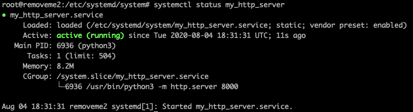
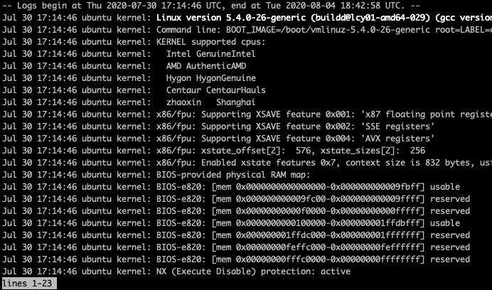

В этом туториале вы сделаете простой одностраничный сайт. Сайт, который никогда не падает, а если падает, то всегда поднимается.
Вы сможете применить это не только к сайтам, но и к программам, которые вы хотите запустить на сервере.

### 0. Загрузите сайт на сервер

Сначала сделайте так, чтобы можно было просто посмотреть сайт в браузере.

Подкючитесь к вашему серверу по ssh.

Пройдите в главную папку сервера с помощью команды

`cd /`

Нужна папка, в которой будет лежать обычный html-файлик - исходный [код сайта.](https://raw.githubusercontent.com/su1tanb3k/systemd_tutorial/master/index.html)

Создайте папку и назовите её `public_html`. Для этого выполните команду

`mkdir public_html`

Зайдите в неё

`cd public_html`

Загрузите туда html-файл

`wget https://raw.githubusercontent.com/su1tanb3k/systemd_tutorial/master/index.html`

Проверьте достаточно ли этого, чтобы сайт заработал. Пройдите по этому адресу

`84.38.180.108:8000/public_html/`

Только вместо `84.38.180.108` вставьте ip-адрес вашего сервера. И когда в туториале встретите этот адрес меняйте его на свой.


Сайт не работает :(

Это потому что сервер не общается с браузером.

### 1. Запустите HTTP-сервер

Нужно запустить HTTP-сервер, чтобы сервер и браузер общались.

Введите в терминале команду

```bash
python3 -m http.server --bind 84.38.180.108 --directory public_html 8000
```

Проверьте заработал ли сайт


Сайт работает!

Теперь выйдите из терминала.
Просто закройте окошко терминала или введите `exit` и нажмите `Enter`.

Теперь сайт перестал работать :(

Всё потому что вы закрыли ssh соединение и поэтому сервер остановил работу HTTP-сервера.

На каждое соединение сервер тратит свои мощности. Мощности у него ограниченные. Поэтому сервер всегда стремится сэкономить их закрывая неработающие соединения. А оставлять открытые соединения небезопасно.

Нужно сделать так, чтобы HTTP-сервер продолжал работать без открытого соединения по ssh.

### 2. Запустите HTTP-сервер на фоне

Нужно запустить HTTP-сервер в фоновом режиме работы. Программы, которые работают в фоновом режиме называются демонами. Или программами в режиме демона.

Программа **systemd** запустит HTTP-сервер в режиме демона. Но сначала для systemd нужно написать специальный файл-инструкцию.

Перейдите в папку

`cd /etc/systemd/system`

Создайте новый файл-инструкцию с названием `my_http_server.service`
 
Запишите в него этот текст
 
```
[Service]
ExecStart=python -m http.server --bind 84.38.180.108 --directory public_html 8000
```

> В `ExecStart=` вписали команду, которую systemd должен запустить при запуске файла

Запустите файл с помощью команды

`systemctl start my_http_server`

Упс! Ошибка:

```bash
# systemctl start my_http_server
Failed to start my_http_server.service: Unit my_http_server.service has a bad unit file setting.
See system logs and 'systemctl status my_http_server.service' for details.
```

Авторский перевод: *Неудалось запустить файл my_http_server.service: в нём плохие инструкции. Запустите команду `systemctl status my_http_server.service` , чтобы узнать что случилось.*

Давайте узнаем! Запустите команду `systemctl status my_http_server`

Ответ:


Строка `Active: inactive (dead)` значит что файл неактивен/"мёртв"

Красная строка `/etc/systemd/system/my_http_server.service:2: Executable "python" not found in path "/usr/local/sbin:/usr/local/bin:/usr/sbin:/usr/bin:/sbin:/bin"`
значит, что systemd не смог найти `python` в папке `/usr/bin/`.

Действительно, в этой папке есть только `python3` и `python3.8`.

Измените содержание файла на такое

```
[Service]
ExecStart=python3 -m http.server --bind 84.38.180.108 --directory public_html 8000
```

Повторите запуск файла

`systemctl start my_http_server`.

Терминал молчит. Это хороший знак?

Проверьте состояние файла

`systemctl status my_http_server`

Ответ:



Строка `●my_http_server.service`. Кружок возле названия нашего файла стал зелёным, а в прошлый раз был черный.

Строка `Active: active (running)`. Слова `active (running)` значит файл запущен. Как и кружок они стали зелеными, а в прошлый раз они были красными.

>*Зелёный цвет - это хороший знак.*

Проверьте сайт в браузере.

Сайт работает! Успех!

Убедитесь в этом.

Закройте терминал или наберите команду `exit` и затем `Enter`.

```bash
# exit
logout
Connection to 84.38.180.108 closed.
```

Проверьте сайт в браузере.

Поздравляю! Сайт работает даже если закроете терминал.


### 3. Добавьте в автозапуск

Сервер иногда приходится перезапускать из-за обновления ПО и изменения настроек.
Ещё хостинг провайдер периодически обновляет софт, чтобы закрыть свежие уязвимости, и самостоятельно перезапускает сервер.

Проверьте, что станет с сайтом если сервер перезагрузится.

Перезагрузите сервер с помощью команды

`reboot now`

Проверьте сайт в браузере


Сайт перестал работать :( 

Это потому что мы не сказали systemd запускать наш файл если сервер включается или перезагружается.

Измените файл `my_http_server.service`. Он должен стать таким:

```
[Service]
ExecStart=python3 -m http.server --bind 84.38.180.108 --directory public_html 8000

[Install]
WantedBy=multi-user.target
```

Введите команду `systemctl enable my_http_server`

Ответ:

```
# systemctl enable my_http_server
Created symlink /etc/systemd/system/multi-user.target.wants/my_http_server.service → /etc/systemd/system/my_http_server.service.
```

Перезагрузите сервер с помощью команды `reboot now`

Проверьте сайт в браузере.

Поздравляю! Сайт продолжает работать даже если вы закроете терминал или перезагрузите сервер.

### 4. Автозапуск в случае сбоя

Плохая новость: программы иногда ломаются.

HTTP-сервер, который вы сейчас используете, это тоже программа. Что если в ней случится сбой и файл из-за этого перестанет работать?

Сымитируйте поломку программы - резко остановите работу файла.

Запустите команду

```systemctl kill my_http_server```

Сайт не работает :(

Скажите systemd: "Когда файл перестает работать, то файл нужно перезапускать." Для этого отредактируйте файл. Теперь он стал таким:

```
[Service]
ExecStart=python3 -m http.server --bind 84.38.180.108 --directory public_html 8000
Restart=always

[Install]
WantedBy=multi-user.target
```

> `Restart=always` значит "перезагружай файл всегда, когда его работа останавливается"

Запустите файл с помощью команды `systemctl start my_http_server`

Ответ:

```bash
# systemctl start my_http_server
Warning: The unit file, source configuration file or drop-ins of my_http_server.service changed on disk. Run 'systemctl daemon-reload' to reload units.
```

Автоский перевод: *Внимание: ваш файл-инструкция был изменен. Запустите команду `systemctl daemon-reload`, чтобы перезагрузить ваш файл.*

Если вы что-то изменили в файле, то всегда запускайте команду `systemctl daemon-reload`, чтобы systemd перезапустил файл.

>Мы и до этого измененяли в файл, но ни разу не запускали эту команду.
>В те разы мы полностью перезагружали сервер.
>Поэтому systemd тоже перезапускался и запускал уже обновленный файл.

Запустите команду

`systemctl daemon-reload`

Повторите запуск файла

`systemctl start my_http_server`.

Ещё раз резко прервите работу файла

`systemctl kill my_http_server`

Проверьте сайт в браузере

Поздравляю! Теперь сайт работает во всех трёх случаях: после закрытия терминала, после перезагрузки и после сбоя в демоне.

### 5. Посмотреть лог

Чтобы разобраться почему поломалась программа, нужно посмотреть где и когда она дала сбой.

Systemd всегда ведет исхотрию работы файлов, т.е. он всегда пишет логи. Посмотрите, что происходило со всеми процессами на сервере.

Запустите команду `journalctl`:

Показана вся история с начала работы systemd:



Запустите `journalctl -b`:

Будут показаны записи с последнего запуска системы.
    
Посмотрите историю работы только по одному файлу - `my_http_server`

Запустите команду

`journalctl -u my_http_server`


Запустите команду

`journalctl -f -u my_http_server`

Показана история работы по файлу в режиме реального времени. Периодически на экране будут появляться новые записи.

### Читать дальше

1. https://tproger.ru/translations/how-to-love-systemd/
2. https://www.digitalocean.com/community/tutorials/understanding-systemd-units-and-unit-files (Аналог на русском https://linux-notes.org/pishem-systemd-unit-fajl/)
3. https://www.digitalocean.com/community/tutorials/how-to-use-systemctl-to-manage-systemd-services-and-units
4. https://pikabu.ru/story/systemd_dlya_samyikh_malenkikh_chast_i_znakomstvo_4285483
5. [Документация systemd](https://www.freedesktop.org/software/systemd/man/systemd.service.html)